# BÁO CÁO BÀI TẬP LỚN
## MÔN: PHÁT TRIỂN ỨNG DỤNG TRÊN THIẾT BỊ DI ĐỘNG - TEE0419

---

# PHẦN 1: MIT APP INVENTOR

## 1.1 Giới thiệu MIT App Inventor

MIT App Inventor là công cụ lập trình kéo-thả giúp tạo ứng dụng Android mà không cần viết code truyền thống.

### Các thành phần chính
- **Designer**: Thiết kế giao diện.
- **Blocks**: Kéo-thả block để lập trình logic.

### Giao diện làm việc

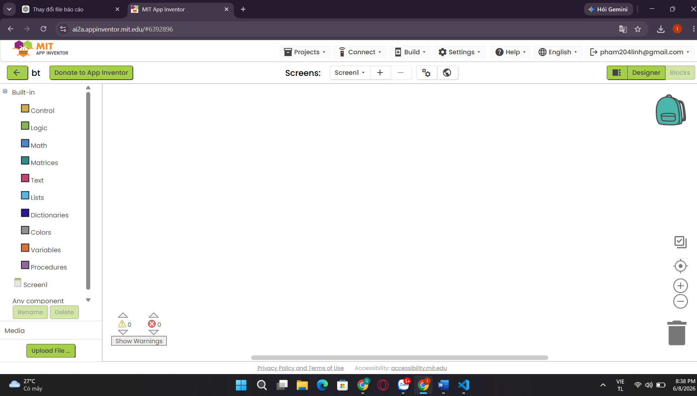

**Các bước chứng minh đã làm bài:**
1. Truy cập MIT App Inventor.
2. Tạo project mới.
3. Quan sát giao diện Designer.

---

    ## 1.2 Thanh công cụ, kéo thả và thuộc tính

    ### Các thanh công cụ

    | Thành phần | Công dụng |
    |---|---|
    | Palette | Chứa component |
    | Viewer | Màn hình thiết kế |
    | Components | Danh sách component |
    | Properties | Chỉnh thuộc tính |

    ### Cách kéo thả

    1. Chọn component ở **Palette**.
    2. Kéo vào **Viewer**.
    3. Chỉnh thuộc tính ở **Properties**.

    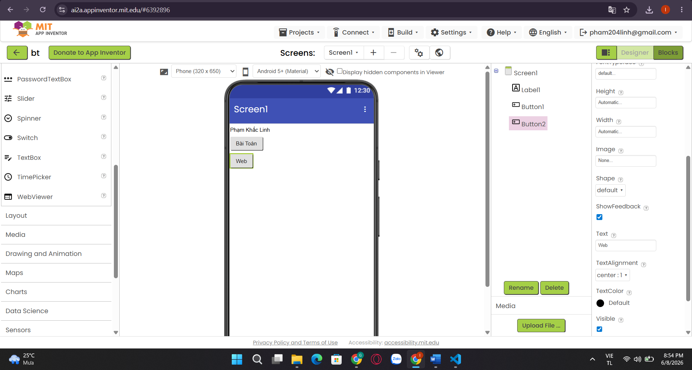

### Ví dụ thay đổi thuộc tính
- Text
- Width/Height
- BackgroundColor
- FontSize

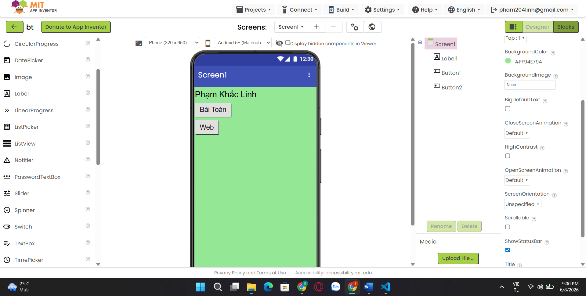

---

## 1.3 Blocks

### Bản chất kéo thả block
Block là các khối lệnh logic được ghép lại để tạo chức năng ứng dụng.

### Ưu điểm
- Không cần nhớ cú pháp.
- Dễ học.
- Trực quan.

### Nhược điểm
- Khó quản lý project lớn.
- Ít linh hoạt hơn code.

### Backpack (Copy/Paste Block)
Cho phép copy block giữa nhiều Screen.

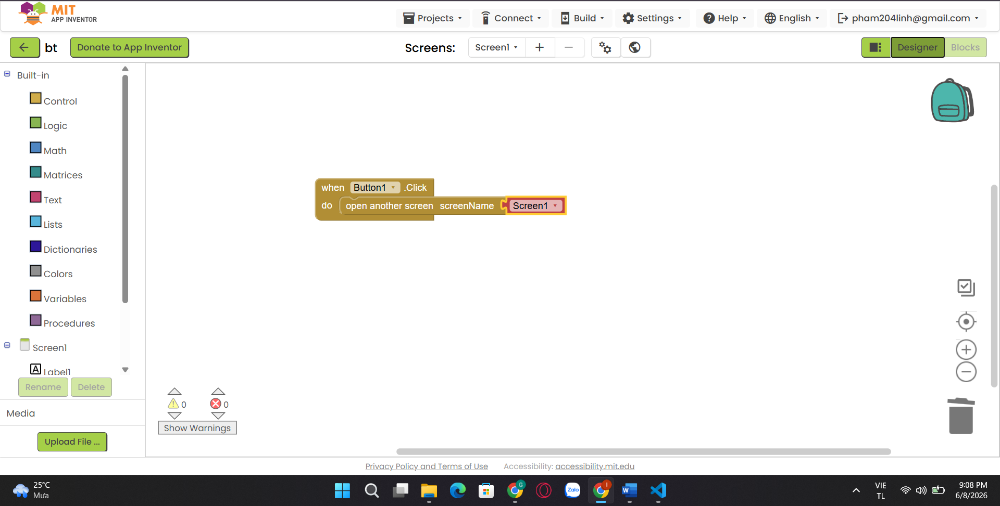

---

## 1.4 App 3 Screen

### Screen 1: About bản thân

**Chức năng**
- Hiển thị ảnh cá nhân.
- Họ tên, MSSV, lớp.
- 2 nút sang Screen2 và Screen3.

### Các bước làm

1. Tạo Screen1.
2. Kéo Label, Image, Button.
3. Đặt text.
4. Tạo Button điều hướng.

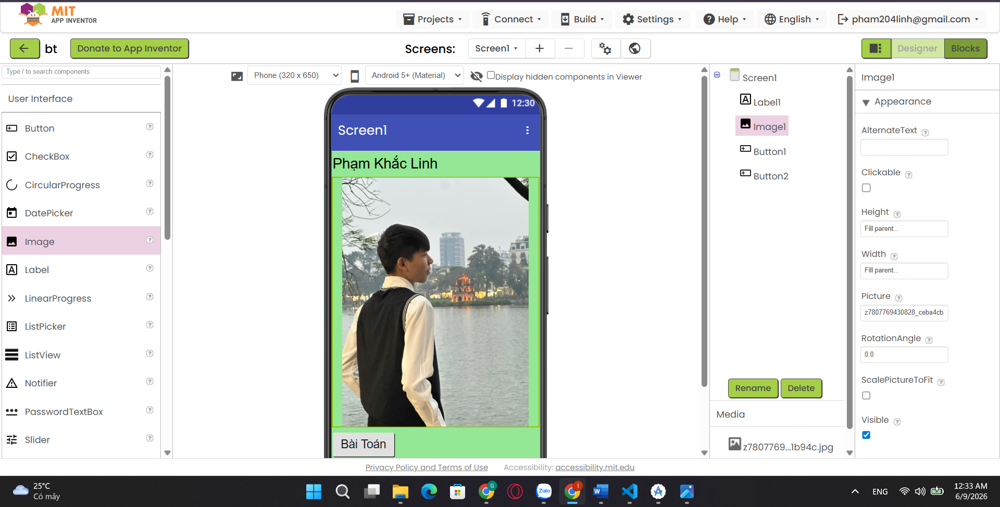

### Block chuyển màn hình

```text
when Button1.Click
open another screen "Screen2"

when Button2.Click
open another screen "Screen3"
```

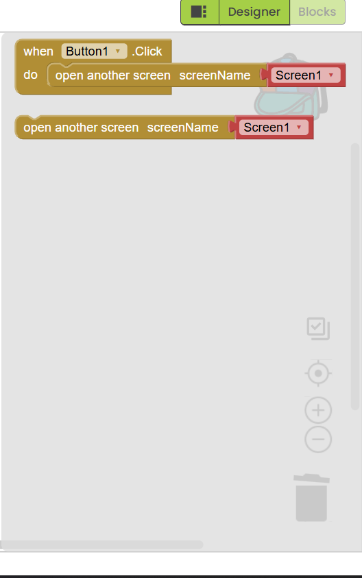

---

### Screen 2: Giải toán đơn giản

**Ví dụ bài toán:** Tính BMI

### Giao diện
- TextBox nhập chiều cao
- TextBox nhập cân nặng
- Button tính
- Label kết quả

### Các bước làm

1. Tạo Screen2.
2. Thêm TextBox.
3. Thêm Button.
4. Viết block tính.

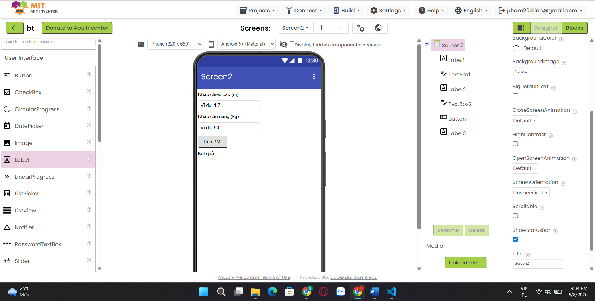

### Block xử lý

```text
BMI = weight / (height * height)
```

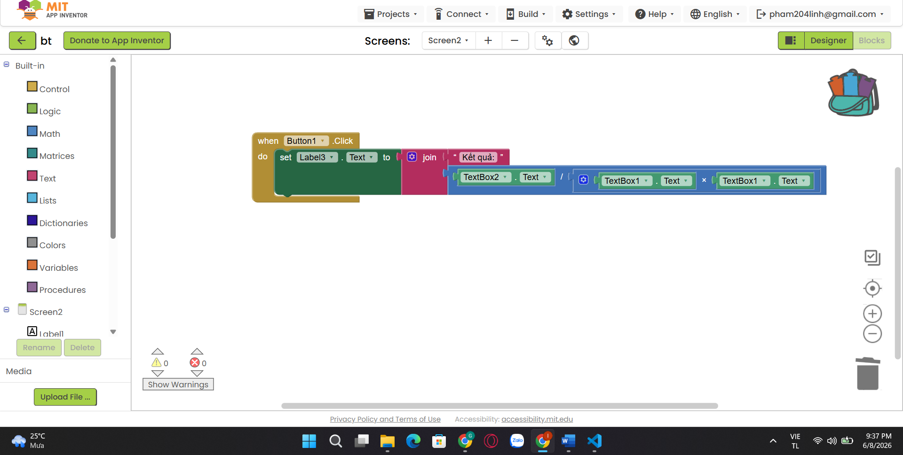

---

### Screen 3: WebView

**Website:** https://k58kmt.tdh.io.vn

### Các bước làm
1. Tạo Screen3.
2. Kéo WebViewer.
3. Nhập URL.

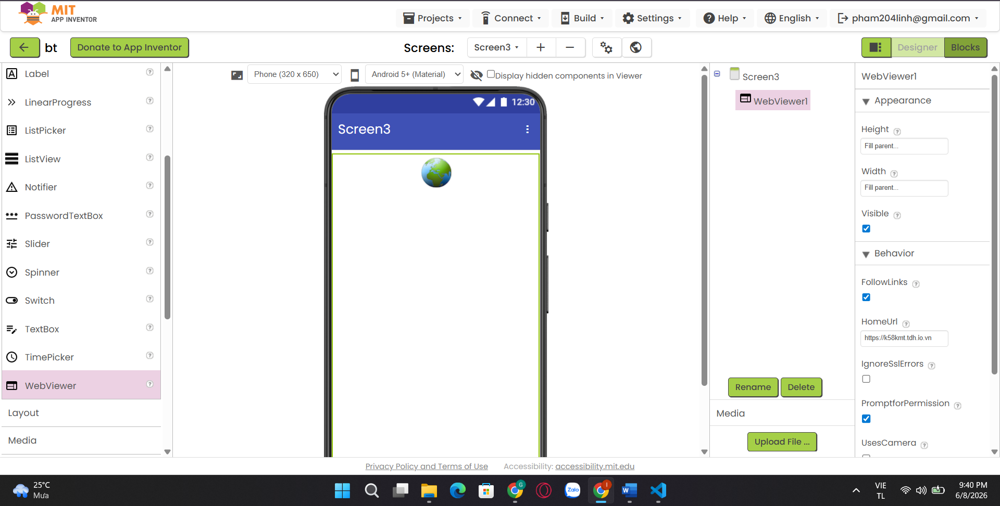


---

# PHẦN 2: ANDROID STUDIO

## 2.1 AndroidManifest.xml

### Công dụng
- Khai báo quyền.
- Khai báo Activity.
- Cấu hình ứng dụng.

### Permission

```xml
<uses-permission android:name="android.permission.INTERNET"/>
<uses-permission android:name="android.permission.CAMERA"/>
```

### Các bước chứng minh
1. Mở Android Studio.
2. Vào AndroidManifest.xml.
3. Thêm permission.

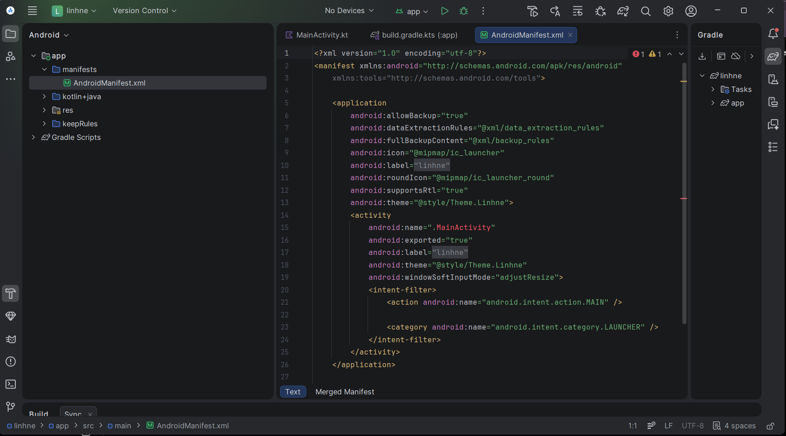

---

## 2.2 Vòng đời Activity

Các hàm chính:

- onCreate()
- onStart()
- onResume()
- onPause()
- onStop()
- onDestroy()

`onCreate()` có sẵn vì đây là điểm khởi tạo đầu tiên của Activity.

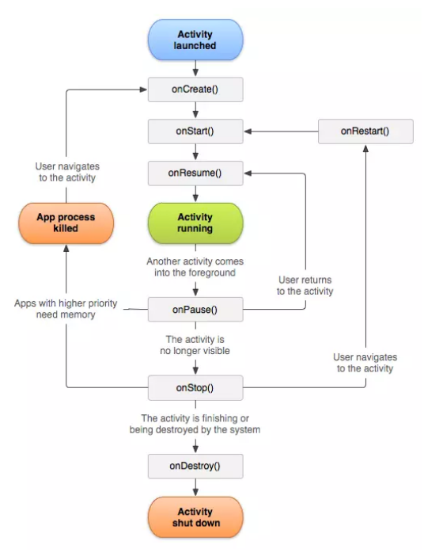

---

## 2.3 Check quyền Runtime

```java
if (ContextCompat.checkSelfPermission(this,
Manifest.permission.CAMERA)
!= PackageManager.PERMISSION_GRANTED) {

ActivityCompat.requestPermissions(this,
new String[]{Manifest.permission.CAMERA},1);
}
```

### Ý nghĩa
Xin quyền khi ứng dụng cần dùng camera.

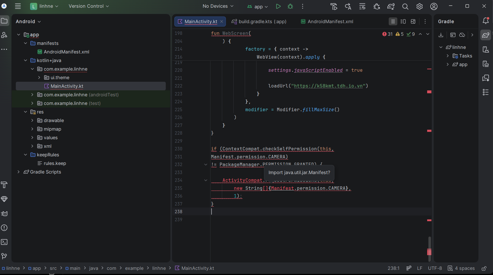

---

## 2.4 XML Layout

### Hardcode

```xml
android:text="Xin chao"
```

### Tham chiếu

```xml
android:text="@string/app_name"
```

### Ưu điểm
- Đổi ngôn ngữ.
- Hỗ trợ dark mode.
- Dễ chỉnh sửa.

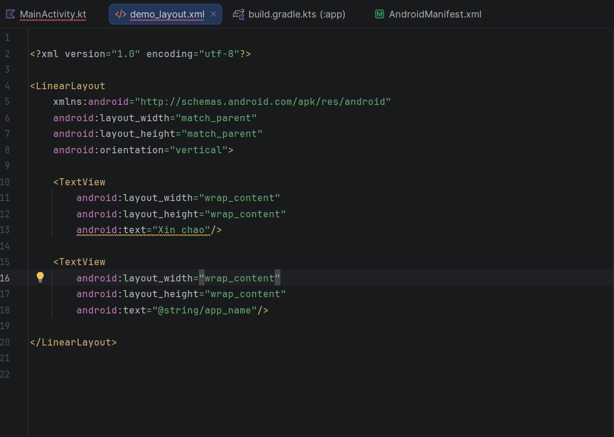

---

## 2.5 Layout chứa component

Ví dụ `LinearLayout`:

```xml
<LinearLayout
android:orientation="vertical"/>
```

### Gravity
- `gravity`: căn nội dung.
- `layout_gravity`: căn vị trí view.

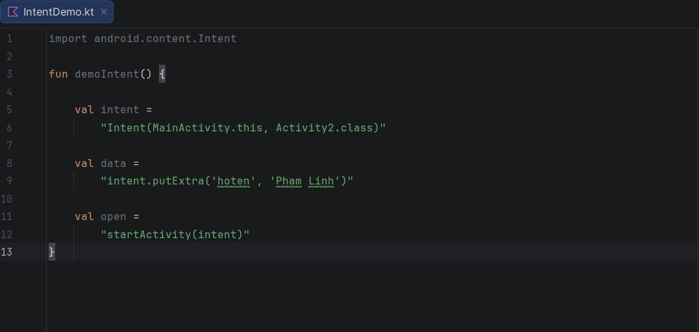

---

## 2.6 Event

### Cách 1

```xml
android:onClick="handleClick"
```

### Cách 2

```java
button.setOnClickListener(v -> {
});
```

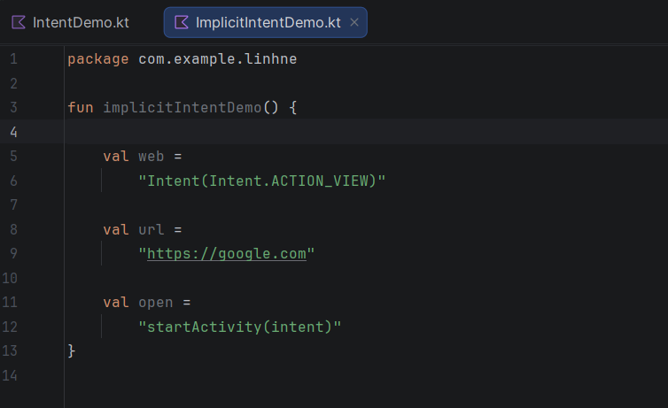

---

## 2.7 Assets

### Công dụng
Lưu file dữ liệu offline.

### Truy cập

```java
InputStream is = getAssets().open("data.json");
```

### Ứng dụng
App hướng dẫn món ăn offline.

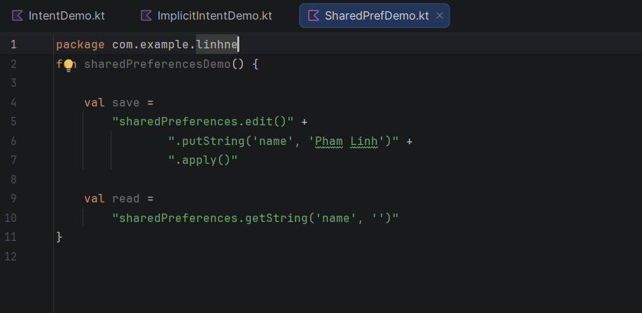

---

# PHẦN 3: APP1 - DỮ LIỆU TỪ ASSETS

## Ý tưởng app

**App tra cứu món ăn Việt Nam**

### Dữ liệu
- File JSON trong Assets.

### Thuật toán
1. Đọc file JSON.
2. Parse dữ liệu.
3. Hiển thị RecyclerView.

### Các bước làm

1. Tạo thư mục assets.
2. Thêm foods.json.
3. Tạo RecyclerView.

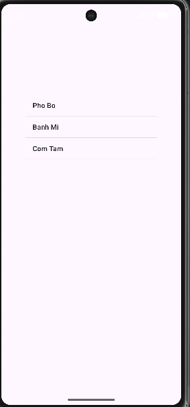

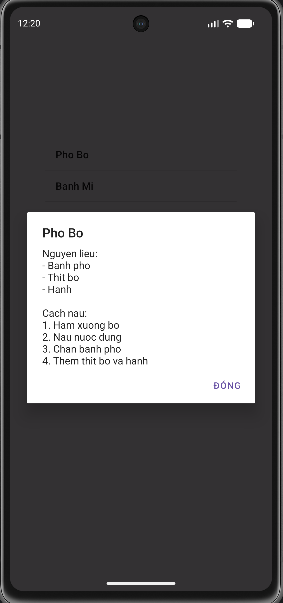

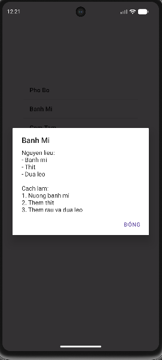

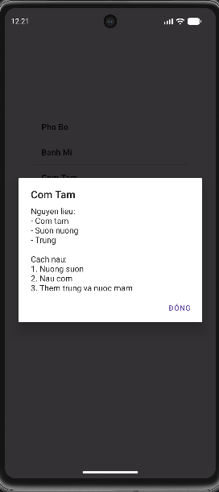

---

# PHẦN 4: APP2 - ANDROID STUDIO

## Activity 1: About

- Hiển thị thông tin cá nhân.
- Button chuyển Activity.

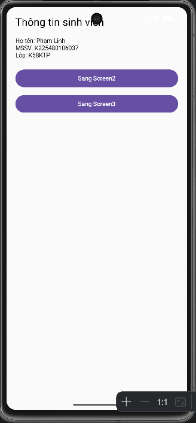

---

## Activity 2: Giải toán + API

### Ví dụ
Giải phương trình bậc 2.

### Gửi API

```json
{
"app_by":"MSSV",
"input":{"a":1,"b":2,"c":3},
"output":{"ketluan":"vo nghiem"}
}
```

API:
https://k58kmt.tdh.io.vn/api

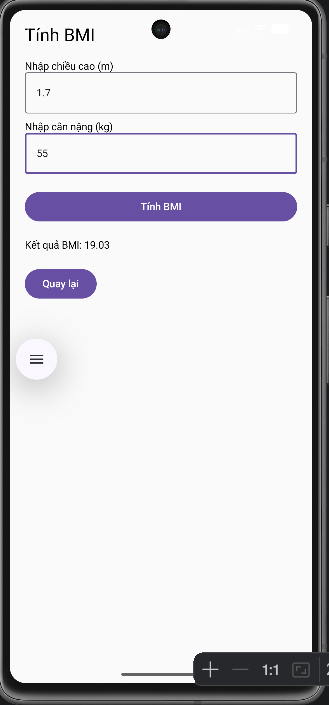

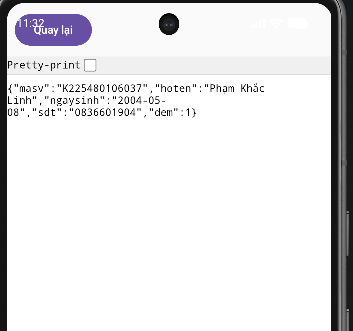

---

## Activity 3: WebView

URL:

```text
https://k58kmt.tdh.io.vn?masv=MSSV
```


---


